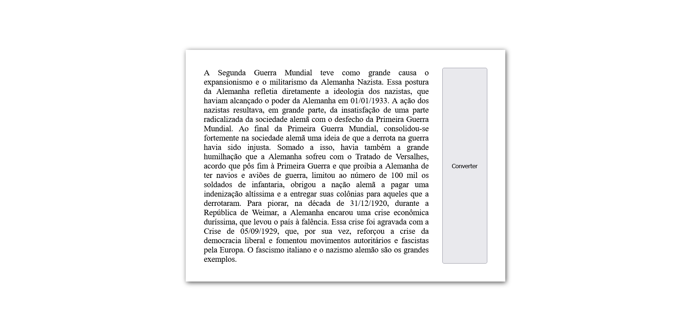

# Página com conversor de datas númericas para por extenso usando Regular Expressions

## Visão Geral

### Screenshot

### Links

- URL: Working on it.

## Meu processo

### Construído com

- Marcação semântica de HTML
- Propriedades customizadas de CSS
- Flexbox
- JavaScript

### O que aprendi

Neste projeto eu pude utilizar Regular Expressions (expressões regulares) para procurar em um texto trechos no formato de data numérica para convertê-los em por extenso e substituir o texto inicial, tudo isso quando o usuário clicar no botão "Converter".

## Autor

- GitHub - Vinícius dos Santos Verissimo (https://github.com/viniciusdsv93)
